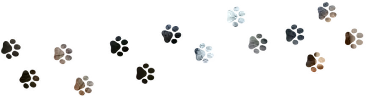
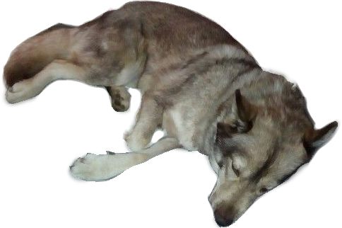

<blockquote>

  " life needed a bit of madness ,</i>

</blockquote>

  

   
  <a href="https://pronouns.cc/@10th"> pronouns.cc </a> | <a href="https://10th.atabook.org/"> atabook </a> 

 

  
byi

   

    
   

     
     
     
     
     
    <i> 🐾 tenth</i> + <b>claims in regis</b>
     <i><b>prefered if you call me by what skin you saw me in!</b> that's usually the kin im going by.</i>
     github nickname changes accordingly! mainly wade , simon , driver/k , warfstache. 
     
    
     
    <i>it/its</i> , he/him , any
     <b>i do not respond to neos (with respect to neousers)</b>
     
     
     
     
     
      
    
    

      
       
       
       
      

      
<b><i> byf </i></b>

        
  i do not follow back unless i know you / consider you a friend, and just get awkward around people i don't consider acquaintances. if i'm talking dry or just not talking at all, don't feel offended. i warm up after a few days. sometimes it may mean i'm just tired.

        
  <u><b>i am a fictionkin.</b></u> i don't like using the term, so i will not say that often. i shift through kins day-to-day (sometimes less frequent if the kin is recently obtained) and will act differently with every name i place on myself. i will act dry at certain times (even with acquaintences and friends) and sometimes will be more unserious. 

        
  i do not get excited if you're in the same fandoms as me. i usually don't even know what to reply to being in the same fandomspace as others. please don't get offended if my replies feel dry or uninterested. 

    

    

      
<b><i> kins </i></b>

      deadpool / wade , simon (iron lung) , warfstache (markcu) , patrick jane (the mentalist) , 10th doctor (doctor who) , barry allen , spiderman / peter parker , flamefrags (uu) , parrotx2 (uu) 
      
 will be adjusted according to shifted kin and preference every once in a while ^_^ 

    

    

      
<b><i> dni </i></b>

      <ul>
      <li><a href="https://basic-dni.crd.co"> basic dni crit</a></li>
      <li> minors below 12 / adults above 18 be cautious </li>
      <li> to specify from the basic dni list : self-diagnoses are fine under the right perimeters, please do not 'diagnose' or 'psychologically analyze' me, and don't do it around me. </li>
      <li> do not call me autistic/adhd or any mental illness (unless a CLOSE friend and jokingly). i am not diagnosed with anything and am not comfortable with simplifying mental illnesses to their basic descriptions. </li>
      <li> don't tell me to stop acting different when i shift kins, i have no choice on the matter and used to frequently force it down which caused apathy so fucking bad i genuinely didn't know who i was for a while, it SUCKED. </li>
      <li> venting/ranting without asking (unless friend) </li>
      <li> you think touch/cover discomfort/triggers aren't an actual thing </li>
      <li> romantiscizes self harm and sexual assault due to house of puso (or other media) </li>
      </ul>
    

       
      
       
    

 

 
  

<blockquote>
  

    <i> why should death be any different? "</i>
  

</blockquote>
